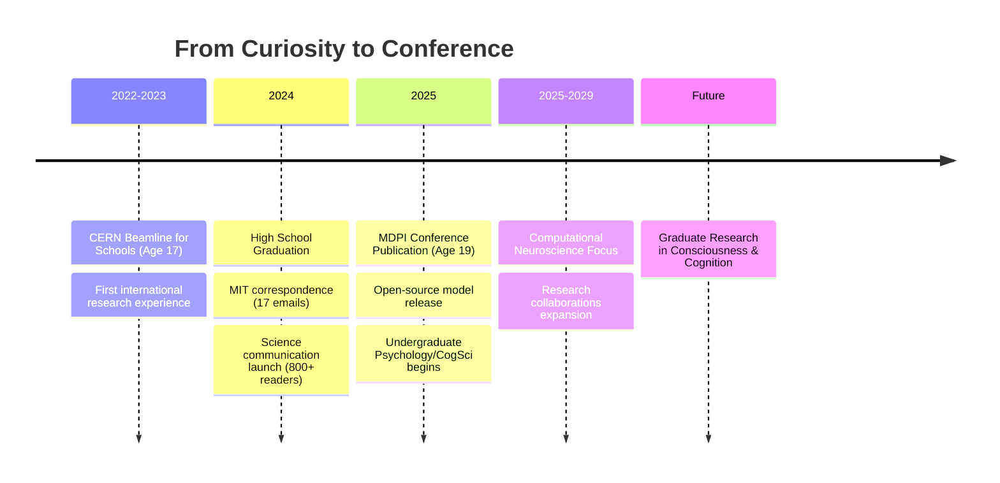

<div align="center">


# 👋 Hi, I'm Yusuf Cemal İşbuğa

**19-year-old independent researcher | Published at MDPI | Contestant (STRANGERS Türkiye)**

*From understanding physical systems → to understanding the system that understands*

[](https://www.linkedin.com/in/ycisbuga)
[](https://orcid.org/0009-0001-7565-9753)
[](https://yusufcemalisbuga2025.netlify.app/)
[](mailto:yisbuga37@gmail.com)


</div>

---

## 🎯 Who Am I?

```python
class Researcher:
    def __init__(self):
        self.age = 19
        self.status = "High School Graduate (2024) → Psychology/CogSci Undergrad (2025+)"
        self.mission = "Bridging theoretical physics, computation, and cognitive science"
        
    def research_areas(self):
        return {
            "theoretical": ["Quantum Measurement", "Thermodynamics", "Observer Effects"],
            "computational": ["Energy Systems", "Control Theory", "Neural Modeling"],
            "cognitive": ["Consciousness", "Information Processing", "Mind-Matter Interface"]
        }
    
    def philosophy(self):
        return "Transparent iteration. Publish failures. Validate rigorously."
```

<div align="center">

### 💡 What Makes Me Different?

**I publish my failures** • Peer-reviewed at 18 • CERN at 17 • 800+ science readers • Open-source advocate

</div>

---

## 🏆 Highlight Reel

<table>
<tr>
<td width="33%" align="center">

### ⚛️ CERN 2023
**Beamline for Schools**

Team STRANGER/Türkiye  
Muon lifetime analysis  
Age 17

</td>
<td width="33%" align="center">

### 📄 MDPI 2025
**Conference Publication**

First-author at 18  
Thermodynamic feasibility  
Peer-reviewed

</td>
<td width="33%" align="center">

### ✍️ Science Writer
**800+ Readers**

Neuroscience, psychology  
Popular science articles  
Turkish platform leader

</td>
</tr>
</table>

---

## 🔥 Featured Project

<div align="center">

### 🚗 [HEPV Feasibility Analyzer](https://github.com/yusufcemalisbuga/HEPV-Feasibility-Analyzer)

[](https://sciforum.net/paper/view/24624)
[](https://www.python.org/)
[](https://github.com/yusufcemalisbuga/HEPV-Feasibility-Analyzer/blob/main/LICENSE)
[](https://github.com/yusufcemalisbuga/HEPV-Feasibility-Analyzer)

</div>

> **Research Question:** Can compressed air hybridization compete with pure battery electric vehicles?  
> **Answer:** No. +2.9% efficiency penalty makes it commercially non-viable.  
> **Impact:** First open-source, conference-validated thermodynamic proof preventing future resource waste.

<details>
<summary><b>📊 The Transparent Research Journey</b></summary>

<br>

**Version History (Honest Iteration):**

```diff
v1.0 (2022): Passive system design
! Result: +11% efficiency penalty
- Conclusion: Failed, but learned thermodynamics fundamentals

v2.0 (2023): Active thermal management
! Result: +7% penalty
~ Progress, but still not viable

v3.0 (2024): Optimized control strategy
! Result: -5% improvement (suspicious!)
? Red flag: Too good to be true

v3.3 (2025): Physics-corrected model
+ Result: +2.9% penalty (validated)
✓ Accepted at MDPI ECP 2025
✓ Aligns with real-world failures (Tata, MDI)
```

**Key Learning:** Control optimization matters, but thermodynamic reality always wins.

**Technologies:** Python • NumPy • Matplotlib • Control Theory • First-Principles Thermodynamics

[📄 Read Paper](https://sciforum.net/paper/view/24624) • [💻 View Code](https://github.com/yusufcemalisbuga/HEPV-Feasibility-Analyzer) • [📊 Documentation](https://github.com/yusufcemalisbuga/HEPV-Feasibility-Analyzer#readme)

</details>

---

## 📚 Research Portfolio

### 🔬 Theoretical Physics

<table>
<tr>
<td width="70%">

**"The Minimal Observer: Why Perfectly Passive Time Travel Is Impossible"**

Exploring thermodynamic constraints on observation and information extraction. Core thesis: Any observer capable of extracting information must thermodynamically interact with the system, placing fundamental limits on "passive" time travel scenarios.

</td>
<td width="30%" align="center">

**Status**  
✍️ Writing  
📅 Coming Soon  

**Topics**  
Quantum Measurement  
Thermodynamics  
Causality

</td>
</tr>
</table>

### 🚗 Sustainable Engineering

<table>
<tr>
<td width="70%">

**"Hybrid Electric-Pneumatic Vehicles: Feasibility Analysis and Practical Limitations"**

First rigorous thermodynamic analysis proving commercial non-viability of compressed air hybridization through validated computational modeling and real-world data comparison.

</td>
<td width="30%" align="center">

**Status**  
✅ Accepted  
📅 Oct 2025  

**Venue**  
MDPI ECP 2025  
DOI: [24624](https://sciforum.net/paper/view/24624)

</td>
</tr>
</table>

### ✍️ Science Communication

<div align="center">

**Platform:** [Evrim Ağacı](https://evrimagaci.org/leo2311454/blog) | **Reach:** 800+ readers | **Language:** Turkish

</div>

| 🧠 Neuroscience | 🎵 Psychology | 🧬 Mental Health | 🤔 Philosophy |
|----------------|---------------|-----------------|---------------|
| [The Science of Love](https://evrimagaci.org/blog/askin-bilimi-askin-fizyolojik-duygusal-ve-zihinsel-boyutlari-15953) | [Psychology and Music](https://evrimagaci.org/blog/psikoloji-ve-muzik-15712) | [Depression & the Brain](https://evrimagaci.org/blog/depresyon-ve-insan-beyni-17248) | [Philosophy & Science](https://evrimagaci.org/blog/felsefe-ve-bilim-16133) |

---

## 🛠️ Technical Stack

<div align="center">


</div>

<table>
<tr>
<td width="50%">

**🔬 Research Methods**
- First-principles thermodynamic analysis
- Validated computational modeling
- Control strategy optimization
- Sensitivity analysis & validation
- Transparent failure reporting
- Open-source methodology

</td>
<td width="50%">

**🎯 Active Interests**
- Quantum measurement theory
- Thermodynamics of observation
- Computational cognitive science
- Control theory & optimization
- Consciousness studies
- Neural information processing

</td>
</tr>
</table>

---

## 💡 Research Philosophy

<div align="center">

> *"Children can only aspire to what they know exists."*  
> — **Prof. Ger Graus OBE** (Education Technology Pioneer, BAFTA Jury)

</div>

### 🌟 Core Principles

```diff
+ Iterative Process: Models evolve through rigorous refinement
+ Transparent Reporting: Share both successes AND failures publicly
+ First-Principles Thinking: Build understanding from fundamental physics
+ Critical Self-Review: Question results that seem too good to be true
+ Open Science: Make code, data, and methodology freely available
+ Interdisciplinary Approach: Bridges between physics, computation, and cognition
```

### 🎓 Case Study: Learning from "Failure"

My HEPV project exemplifies transparent iteration:

1. **Initial enthusiasm** (v1.0): "This could revolutionize transport!"
2. **Reality check** (v2.0): Thermodynamic losses are significant
3. **False hope** (v3.0): Optimization shows improvement → Too suspicious
4. **Validated truth** (v3.3): Physics-corrected model confirms non-viability
5. **Publication** (2025): Conference accepts honest negative result

**Lesson:** The scientific method works when you let it. Negative results prevent wasted resources.

---

## 🔭 Current Work (2025)

<div align="center">

| Project | Status | How You Can Contribute |
|---------|--------|------------------------|
| 🧠 **Minimal Observer Theory** | ✍️ Writing | Looking for: Peer reviewers in quantum thermodynamics |
| 🚗 **HEPV v3.3.0** | 📊 Preparing presentation | Looking for: Conference attendees, validation data |
| 🧮 **Cognitive Modeling Framework** | 🔨 Early development | Looking for: Computational neuroscience collaborators |

</div>

### 🤝 Open to Collaboration On:

<table>
<tr>
<td align="center">🧠</td>
<td><b>Cognitive Modeling</b><br>Computational neuroscience, neural simulations, consciousness studies</td>
</tr>
<tr>
<td align="center">🔬</td>
<td><b>Theoretical Physics</b><br>Quantum measurement, observer effects, thermodynamic constraints</td>
</tr>
<tr>
<td align="center">✍️</td>
<td><b>Science Communication</b><br>Popular science writing, interdisciplinary education, Turkish-English translation</td>
</tr>
<tr>
<td align="center">📊</td>
<td><b>Validation Studies</b><br>Experimental data, sensitivity analysis, independent peer review</td>
</tr>
</table>

**Not currently seeking:** Freelance software projects, commercial consulting

---

## 📊 GitHub Activity

<div align="center">


</div>

---

## 🎓 Academic Journey



---

## 🏆 Timeline of Recognition

<div align="center">

| 🗓️ Year | 🎯 Milestone | 📈 Impact |
|---------|-------------|-----------|
| **2022** | Met Prof. Ger Graus OBE + YGA Summit | Global education network |
| **2023** | CERN Beamline for Schools | First international recognition |
| **2024** | Science communication platform | 800+ readers, 4 major articles |
| **2025** | MDPI peer-reviewed publication | First-author at age 19 |
| **2025** | Open-source validated models | Community resource contribution |

</div>

---

## 🌍 Impact & Reach

<div align="center">

```
┌─────────────────────────────────────────────────────────────┐
│                                                             │
│  📄 Publications: 2 (1 published, 1 in preparation)        │
│  👥 Science Readers: 800+ across 4 major articles          │
│  💻 Open-Source: 1 validated model (v3.3.0)                │
│  🌐 Collaborations: CERN, international education network  │
│  🎓 Conference Presentations: MDPI ECP 2025 (upcoming)     │
│                                                             │
└─────────────────────────────────────────────────────────────┘
```

</div>

---

## 📬 Let's Connect

<div align="center">

### 💬 I'd love to hear from you if you're interested in:

**Research collaboration** • **Peer review opportunities** • **Science communication projects**  
**Computational modeling validation** • **Academic discussions** • **Media inquiries**

<br>

[](https://www.linkedin.com/in/ycisbuga)
[](mailto:yisbuga37@gmail.com)
[](https://yusufcemalisbuga2025.netlify.app/)
[](https://orcid.org/0009-0001-7565-9753)

**⏱️ Response time:** 24-48 hours | **📍 Based in:** Istanbul, Turkey

</div>

---

## 🎯 2025 Goals

<div align="center">

| Quarter | Objective | Status |
|---------|-----------|--------|
| **Q1-Q2** | ✅ Complete HEPV v3.3.0 validation | ✅ Done |
| **Q2-Q3** | 🎯 Present at MDPI ECP 2025 Conference | 🟡 Preparing |
| **Q3** | 📚 Begin undergraduate Psychology/CogSci studies | 🟡 Enrolling |
| **Q3-Q4** | 🔬 Submit "Minimal Observer" manuscript | 🟡 Writing |
| **Q4** | 🤝 Establish 3+ research collaborations | 🔵 Planning |
| **Ongoing** | ✍️ Publish 2+ science communication articles | 🟢 Active |

</div>

---

<div align="center">

### 🚀 "Investigating the universe that investigates the universe"

<br>

**⭐ If my work resonates with you, consider starring a repository**  
**💬 Have ideas for collaboration? Let's talk**  
**🔔 Follow for updates on computational modeling, physics, and cognitive science**

<br>

---

<sub>**Research Transparency Note:** All computational studies presented here include methodology, code, and honest iteration history. Negative results are published to prevent resource waste and contribute to collective scientific knowledge.</sub>

---


**Last Updated:** January 2025 • 
[](https://github.com/yusufcemalisbuga) • 
[](https://x.com/Ycisbuga)

</div>
```
