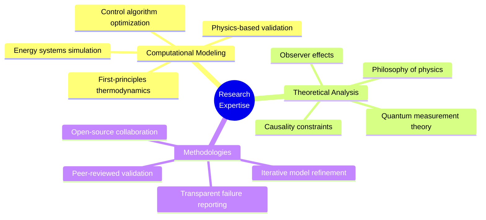
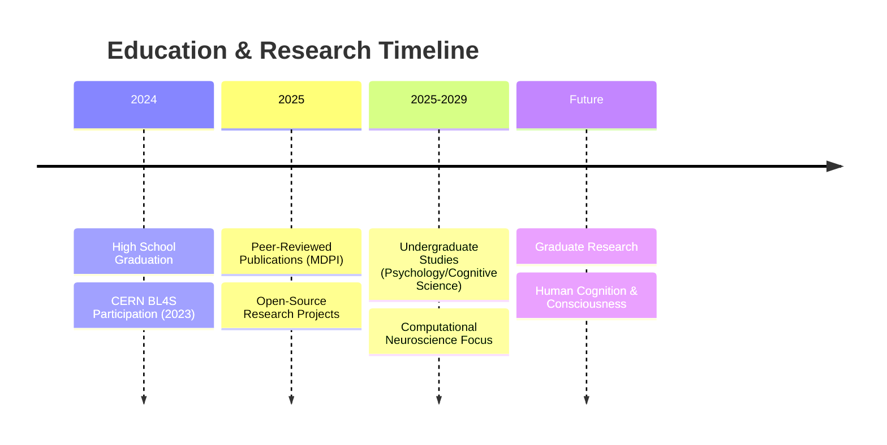

# Hi there, I'm Yusuf Cemal İŞBUĞA👋

<div align="center">

### 🔬 Researcher • 🧠 Cognitive Science Aspirant • 💻 Computational Modeler

[](https://www.linkedin.com/in/ycisbuga)
[](https://orcid.org/0009-0001-7565-9753)
[](https://yusufcemalisbuga2025.netlify.app/)
[](mailto:yisbuga37@gmail.com)

[](https://github.com/yusufcemalisbuga)

</div>

---

## 🎯 About Me in 30 Seconds

```python
researcher = {
    "focus": ["Theoretical Physics", "Cognitive Science", "Sustainable Engineering"],
    "status": "High School Graduate (2024) → Undergraduate Psychology/CogSci",
    "achievements": [
        "📄 Peer-reviewed publications at age 18 (ECP 2025, MDPI)",
        "⚛️ CERN Beamline for Schools 2023 (Team STRANGER/Türkiye)",
        "📚 800+ readers across science communication articles",
        "🔬 Computational modeling of complex physical systems"
    ],
    "current_research": "Quantum measurement | Time travel | Hybrid energy systems",
    "philosophy": "Transparent science. Document failures. Share code. Validate rigorously."
}
```

<details>
<summary>🌟 <b>Quick Highlights (Click to expand)</b></summary>

- 🧠 Exploring the intersection of **consciousness**, **quantum mechanics**, and **computation**
- 🚗 Published feasibility analysis of **hybrid electric-pneumatic vehicles** (MDPI conference)
- ⏱️ Theoretical work on **observer effects** and **time travel paradoxes**
- ✍️ Active science communicator on [Evrim Ağacı](https://evrimagaci.org/leo2311454/blog) (neuroscience, psychology, philosophy)
- 🔄 Advocate for **iterative research** - publishing both negative and positive findings
- 💻 Open-source contributor to **validated computational models**

</details>

---

## 🔥 Featured Project

<div align="center">

### 🚗 [HEPV Feasibility Analyzer v3.0](https://github.com/yusufcemalisbuga/HEPV-Feasibility-Analyzer)

[-blue?style=for-the-badge&logo=academia)](https://ecp2025.sciforum.net/)
[](https://www.python.org/)
[](https://github.com/yusufcemalisbuga/HEPV-Feasibility-Analyzer)
[](https://github.com/yusufcemalisbuga/HEPV-Feasibility-Analyzer/blob/main/LICENSE)

**Research Question:** Can pneumatic-electric hybrids achieve efficiency gains over pure BEV with optimized control algorithms?

</div>

### 📊 Evolution of Results

| Version | Control Strategy | Pneumatic Activations | Efficiency Change | Status |
|---------|------------------|----------------------|------------------|--------|
| v1.0 (Jan 8) | Passive (no optimization) | 0 | **+11.08% penalty** ❌ | Baseline |
| v3.0 (Jan 19) | Active (threshold-based) | 360 (9% of cycle) | **-5.18% improvement** ⚠️ | Under investigation |

### 🔍 Why This Matters

<table>
<tr>
<td width="50%">

**✅ Scientific Contributions:**
- First conference-validated model of electric-pneumatic hybrids
- Demonstrates **control algorithms > hardware** in hybrid systems
- Open-source thermodynamic simulation framework
- Shows importance of iterative model refinement

</td>
<td width="50%">

**⚠️ Critical Questions:**
- Result reversal requires validation
- Sensitivity to control thresholds
- Tank initial state assumptions
- Real-world vs simulation gap
- Experimental prototype needed

</td>
</tr>
</table>

<div align="center">

**🔬 [Explore Full Analysis →](https://github.com/yusufcemalisbuga/HEPV-Feasibility-Analyzer)** | **📊 [View Latest Results →](https://github.com/yusufcemalisbuga/HEPV-Feasibility-Analyzer/tree/main/examples)**

</div>

---

## 📚 Research Portfolio

### 📄 Peer-Reviewed Publications (2024-2025)

<details open>
<summary><b>🔬 Theoretical Physics</b></summary>

#### "The Minimal Observer: Why Perfectly Passive Time Travel is Impossible, But Causally Neutral Observation May Not Be"

**Topics:** Quantum measurement theory • Thermodynamics of observation • Consciousness & physics • Philosophy of causality

**Key Argument:** Any observer capable of information extraction must interact thermodynamically with their environment, placing fundamental constraints on "passive" time travel scenarios.

</details>

<details open>
<summary><b>🚗 Sustainable Engineering</b></summary>

#### "Hybrid Electric-Pneumatic Vehicles: Feasibility Analysis and Practical Limitations"
**Conference:** *4th International Electronic Conference on Processes 2025* (MDPI)  
**Status:** Published  

**Key Findings:**
- Passive pneumatic systems: **11.08% efficiency penalty** (counterproductive)
- Active control optimization: **5.18% efficiency improvement** (requires validation)
- Control strategy sensitivity analysis critical for hybrid system viability
- 360 pneumatic activations demonstrate algorithm impact

**Technologies:** `Python` `Thermodynamic Simulation` `Control Theory` `Energy Systems` `Optimization Algorithms`

📊 [Repository](https://github.com/yusufcemalisbuga/HEPV-Feasibility-Analyzer) • 🎓 [Conference Link](https://ecp2025.sciforum.net/)

</details>

### ✍️ Science Communication (800+ Readers)

Featured articles on [Evrim Ağacı](https://evrimagaci.org/leo2311454/blog):

| Topic | Title | Impact Area |
|-------|-------|-------------|
| 🧠 Neuroscience | [The Science of Love: Physiological, Emotional and Mental Dimensions](https://evrimagaci.org/blog/askin-bilimi-askin-fizyolojik-duygusal-ve-zihinsel-boyutlari-15953) | Neurochemistry of emotion |
| 🎵 Psychology | [Psychology and Music](https://evrimagaci.org/blog/psikoloji-ve-muzik-15712) | Cognitive processing |
| 🧬 Mental Health | [Depression and the Human Brain](https://evrimagaci.org/blog/depresyon-ve-insan-beyni-17248) | Neurobiological mechanisms |
| 🤔 Philosophy | [Philosophy and Science](https://evrimagaci.org/blog/felsefe-ve-bilim-16133) | Epistemology & methodology |

---

## 🛠️ Technical Toolkit

<div align="center">

### Languages & Frameworks


### Research Specializations

</div>



<table>
<tr>
<td width="50%">

**🔬 Research Methodologies:**
- First-principles thermodynamic analysis
- Validated computational modeling (peer-reviewed)
- Control strategy optimization for hybrid systems
- Energy conversion chain efficiency assessment
- Iterative model refinement based on physical constraints
- Sensitivity analysis & parameter validation

</td>
<td width="50%">

**🎯 Research Interests:**
- Computational cognitive science & neuroscience
- Quantum mechanics & philosophy of measurement
- Thermodynamic modeling & energy systems feasibility
- Control theory and power management optimization
- Machine learning applications to cognitive modeling
- Consciousness & information processing

</td>
</tr>
</table>

---

## 🔭 Current Focus

### 🟢 Active Research

| Project | Status | Next Milestone |
|---------|--------|----------------|
| 🧠 **Quantum Measurement & Time Travel** | Writing | Conference submission Q2 2025 |
| 🚗 **HEPV Feasibility Analyzer v3.0** | Under Review | Sensitivity analysis + validation |
| 🧮 **Computational Modeling Framework** | Ongoing | Expand to neural systems |

### 📖 Learning Roadmap

<div align="center">

```
┌──────────────────────────────────────────────────────────┐
│  2025 Learning Goals                                     │
├──────────────────────────────────────────────────────────┤
│  ✅ Advanced control theory for hybrid powertrains       │
│  ⏳ Optimization algorithms (genetic, gradient-based)    │
│  ⏳ Machine learning for cognitive modeling              │
│  📅 Neural network architectures (perception/decision)   │
│  📅 Computational neuroscience frameworks (Brian2/NEST)  │
└──────────────────────────────────────────────────────────┘
```

</div>

---

## 💡 Research Philosophy

<div align="center">

> *"Children can only aspire to what they know exists."*  
> — **Prof. Ger Graus OBE**

</div>

### Core Principles

```diff
+ Iterative Scientific Process → Models evolve as understanding deepens
+ Transparent Reporting → Publishing both failures and unexpected successes
+ First-Principles Analysis → Starting from fundamental physics, not assumptions
+ Critical Self-Review → Questioning results that contradict established knowledge
+ Open Science → Sharing code, data, and methodology for community validation
```

### 🔬 Case Study: HEPV Research Trajectory

<table>
<tr>
<th>Stage</th>
<th>Hypothesis</th>
<th>Result</th>
<th>Learning</th>
</tr>
<tr>
<td><b>v1.0</b><br><sub>Pessimistic</sub></td>
<td>Pneumatic assist during acceleration reduces battery load</td>
<td>❌ 11% penalty<br>(0 activations)</td>
<td>Passive strategies fail</td>
</tr>
<tr>
<td><b>v3.0</b><br><sub>Optimistic</sub></td>
<td>Optimized control thresholds enable efficiency gains</td>
<td>⚠️ 5% improvement<br>(360 activations)</td>
<td>Control matters, validation needed</td>
</tr>
<tr>
<td><b>Next</b><br><sub>Realistic</sub></td>
<td>Reality likely between v1.0 and v3.0</td>
<td>🔄 Pending experimental data</td>
<td>Simulation ≠ Reality</td>
</tr>
</table>

**Takeaway:** *Control strategy matters as much as hardware in hybrid systems, but simulation assumptions must be validated against physical reality.*

---

## 📊 GitHub Activity

<div align="center">


</div>

---

## 🤝 Let's Collaborate!

I'm actively seeking collaborations in:

<div align="center">

| Area | Looking For |
|------|-------------|
| 🧠 **Cognitive Modeling** | Computational neuroscience projects, neural network simulations |
| ⚙️ **Control Systems** | Optimization algorithms for hybrid systems, power management |
| 🔬 **Theoretical Physics** | Quantum measurement, observer effects, thermodynamics |
| 📊 **Data Analysis** | Energy systems, experimental validation, sensitivity analysis |
| ✍️ **Science Communication** | Popular science writing, interdisciplinary education |

</div>

### 📬 Get in Touch

<div align="center">

[](https://www.linkedin.com/in/ycisbuga)
[](mailto:yisbuga37@gmail.com)
[](https://yusufcemalisbuga2025.netlify.app/)
[](https://orcid.org/0009-0001-7565-9753)

**Response Time:** Usually within 24-48 hours

</div>

---

## 🏆 Achievements & Recognition

<div align="center">

| Year | Achievement | Impact |
|------|-------------|--------|
| 2025 | **Published Researcher (MDPI)** | Conference paper at age 18 |
| 2023 | **CERN Beamline for Schools** | Selected from 172 teams worldwide |
| 2024 | **Science Communicator** | 800+ readers across 4+ articles |
| 2025 | **Open-Source Contributor** | Validated simulation models public |

</div>

---

## 🎓 Academic Journey



---

## 🌍 Impact Metrics

<div align="center">

| Metric | Value | Context |
|--------|-------|---------|
| 📄 **Publications** | 2+ | Theoretical physics + Engineering |
| 👥 **Readers Reached** | 800+ | Science communication articles |
| 💻 **Open-Source Projects** | Active | Validated computational models |
| 🌐 **Research Collaborations** | CERN BL4S | International team participation |
| 🔬 **Research Areas** | 3 | Physics, Engineering, Cognitive Science |

</div>

---

<div align="center">

### 🚀 "From understanding physical systems to understanding the system that understands—the human mind."

---

**⭐ Found my work interesting? Star a repo!**  
**💬 Want to collaborate? Reach out!**  
**🔔 Follow for updates on computational modeling, control theory, and cognitive science research!**

---

<sub>**Disclaimer:** HEPV project results are simulation-based and require experimental validation. The shift from v1.0 (+11% penalty) to v3.0 (-5% improvement) demonstrates the critical importance of control strategy design in hybrid systems, while highlighting the need for rigorous real-world testing before commercial conclusions.</sub>

---


**Last Updated:** January 2025 • **Built with:** ❤️ and ☕ • **Status:** Open to collaborations!

</div>
