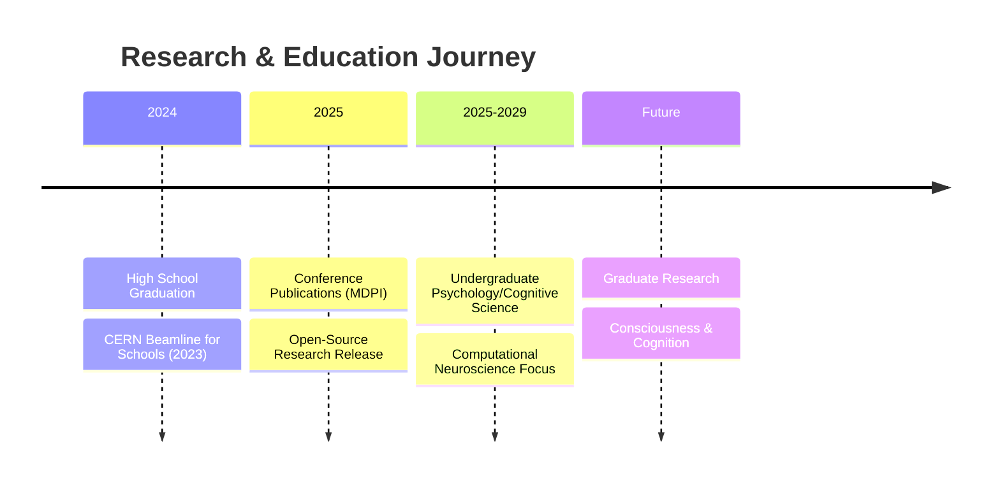

# Hi there, I'm Yusuf Cemal İşbuğa 👋

<div align="center">

### 🔬 Early-Stage Researcher • 🧠 Cognitive Science Aspirant • 💻 Computational Modeler

[](https://www.linkedin.com/in/ycisbuga)
[](https://orcid.org/0009-0001-7565-9753)
[](https://sciprofiles.com/profile/YusufCemalISBUGA)
[](https://yusufcemalisbuga2025.netlify.app/)
[](mailto:yisbuga37@gmail.com)

[](https://github.com/yusufcemalisbuga)

</div>

---

## 🎯 About Me

I'm an early-stage researcher exploring the intersection of **theoretical physics**, **computational modeling**, and **cognitive science**. My work bridges understanding physical systems and the system that understands—the human mind.

```python
researcher = {
    "identity": "High School Graduate (2024) → Undergraduate Psychology/CogSci (2025+)",
    "focus_areas": [
        "Theoretical Physics (Quantum Measurement, Thermodynamics)",
        "Computational Modeling (Energy Systems, Control Theory)",
        "Cognitive Science (Consciousness, Information Processing)"
    ],
    "achievements": {
        "publications": "Peer-reviewed at age 18 (MDPI ECP 2025)",
        "international": "CERN Beamline for Schools 2023 (Team STRANGER/Türkiye)",
        "communication": "800+ readers across science articles (Evrim Ağacı)",
        "open_source": "Validated computational models (GitHub)"
    },
    "philosophy": "Transparent iteration. Publish failures. Validate rigorously."
}
```

<details>
<summary>🌟 <b>Quick Highlights</b></summary>

- 🧠 Bridging **quantum measurement theory** and **consciousness studies**
- 🚗 Published **thermodynamic feasibility analysis** of hybrid energy systems
- ⏱️ Investigating **observer effects** and **causal constraints** in physics
- ✍️ Active **science communicator** (neuroscience, psychology, philosophy)
- 🔄 Advocate for **transparent research** – documenting both successes and failures
- 💻 Contributing **open-source validated models** for community use

</details>

---

## 🔥 Featured Work

<div align="center">

### 🚗 Hybrid Electric-Pneumatic Vehicle Analysis
**[HEPV Feasibility Analyzer](https://github.com/yusufcemalisbuga/HEPV-Feasibility-Analyzer)**

[](https://sciforum.net/paper/view/24624)
[](https://www.python.org/)
[](https://github.com/yusufcemalisbuga/HEPV-Feasibility-Analyzer/blob/main/LICENSE)
[](https://github.com/yusufcemalisbuga/HEPV-Feasibility-Analyzer)

**Conference-validated thermodynamic simulation proving compressed air hybridization cannot compete with pure battery EVs**

</div>

### 🎯 Research Impact

<table>
<tr>
<td width="50%" align="center">

**✅ Contributions**

First conference-validated HEPV model  
Transparent iterative methodology  
Open-source thermodynamic framework  
Validated against industrial data

</td>
<td width="50%" align="center">

**🔬 Key Finding**

+2.9% efficiency penalty vs pure BEV  
Thermodynamic losses prevent viability  
Aligns with real-world project failures  
Prevents future resource waste

</td>
</tr>
</table>

<div align="center">

**[📊 View Repository](https://github.com/yusufcemalisbuga/HEPV-Feasibility-Analyzer)** • **[📄 Conference Paper](https://sciforum.net/paper/view/24624)**

</div>

---

## 📚 Publications & Research

### 📄 Peer-Reviewed Work (2024-2025)

<details>
<summary><b>🔬 Theoretical Physics</b></summary>

#### "The Minimal Observer: Why Perfectly Passive Time Travel is Impossible"

**Status:** PhilSci Archive (2024)  
**Topics:** Quantum measurement • Thermodynamics of observation • Causality constraints

**Core Argument:** Information extraction requires thermodynamic interaction, placing fundamental limits on "passive" time travel scenarios.

</details>

<details>
<summary><b>🚗 Sustainable Engineering</b></summary>

#### "Hybrid Electric-Pneumatic Vehicles: Feasibility Analysis and Practical Limitations"

**Conference:** 4th International Electronic Conference on Processes 2025 (MDPI)  
**Status:** Accepted, peer review in progress  
**DOI:** [10.3390/ecp2025-24624](https://sciforum.net/paper/view/24624)

**Contribution:** First open-source validated model proving commercial non-viability through rigorous thermodynamic analysis.

**Technologies:** Python • NumPy • Matplotlib • Control Theory • Energy Systems Modeling

</details>

### ✍️ Science Communication

**Platform:** [Evrim Ağacı](https://evrimagaci.org/leo2311454/blog) (800+ readers)

| Topic | Article | Focus |
|-------|---------|-------|
| 🧠 Neuroscience | [The Science of Love](https://evrimagaci.org/blog/askin-bilimi-askin-fizyolojik-duygusal-ve-zihinsel-boyutlari-15953) | Neurochemistry of emotion |
| 🎵 Psychology | [Psychology and Music](https://evrimagaci.org/blog/psikoloji-ve-muzik-15712) | Cognitive processing |
| 🧬 Mental Health | [Depression and the Human Brain](https://evrimagaci.org/blog/depresyon-ve-insan-beyni-17248) | Neurobiological mechanisms |
| 🤔 Philosophy | [Philosophy and Science](https://evrimagaci.org/blog/felsefe-ve-bilim-16133) | Epistemology & scientific method |

---

## 🛠️ Technical Expertise

<div align="center">

### Core Skills


</div>

<table>
<tr>
<td width="50%">

**🔬 Research Methodologies**

- First-principles thermodynamic analysis
- Validated computational modeling
- Control strategy optimization
- Iterative model refinement
- Sensitivity analysis & validation
- Transparent failure reporting

</td>
<td width="50%">

**🎯 Research Interests**

- Quantum mechanics & measurement theory
- Thermodynamic modeling & feasibility
- Computational cognitive science
- Control theory & optimization
- Machine learning for cognitive modeling
- Consciousness & information processing

</td>
</tr>
</table>

---

## 🔭 Active Research

<div align="center">

| Project | Status | Next Milestone |
|---------|--------|----------------|
| 🧠 **Quantum Measurement & Time Travel** | Writing | Conference Q2 2025 |
| 🚗 **HEPV Feasibility Analyzer** | v3.3.0 Released | Conference Oct 2025 |
| 🧮 **Computational Framework** | Development | Neural systems expansion |

</div>

---

## 💡 Research Philosophy

<div align="center">

> *"Children can only aspire to what they know exists."*  
> — **Prof. Ger Graus OBE**

</div>

### Guiding Principles

```diff
+ Iterative Process: Models evolve as understanding deepens
+ Transparent Reporting: Publish both successes and failures
+ First-Principles Analysis: Start from fundamental physics
+ Critical Self-Review: Question results contradicting established knowledge
+ Open Science: Share code, data, and methodology publicly
```

### Case Study: Research Transparency

My HEPV project demonstrates honest iteration:
- **v1.0:** Passive system → +11% penalty (confirmed failure)
- **v3.0:** Optimized control → -5% improvement (suspicious, investigated)
- **v3.3:** Physics corrected → +2.9% penalty (validated final result)

**Lesson:** Control strategy matters, but thermodynamic reality prevails.

---

## 📊 GitHub Statistics

<div align="center">


</div>

---

## 🤝 Collaboration Opportunities

<div align="center">

| Area | Seeking |
|------|---------|
| 🧠 **Cognitive Modeling** | Computational neuroscience projects, neural simulations |
| ⚙️ **Control Systems** | Hybrid system optimization, power management |
| 🔬 **Theoretical Physics** | Quantum measurement, observer effects, thermodynamics |
| 📊 **Validation Studies** | Experimental data, sensitivity analysis, peer review |
| ✍️ **Science Communication** | Popular science writing, interdisciplinary education |

</div>

---

## 🏆 Recognition & Milestones

<div align="center">

| Year | Achievement | Impact |
|------|-------------|--------|
| **2025** | 📄 Peer-reviewed publication (age 19) | MDPI ECP 2025 |
| **2023** | ⚛️ CERN Beamline for Schools | Team STRANGER/Türkiye |
| **2024** | ✍️ Science communication | 800+ readers |
| **2025** | 💻 Open-source release | Validated models public |
| **2023** | 🤝 Global education network | Prof. Ger Graus OBE, YGA Summit |

</div>

---

## 🎓 Academic Trajectory



---

## 🌍 Impact Metrics

<div align="center">

| Metric | Current | Trajectory |
|--------|---------|------------|
| 📄 **Publications** | 2 (Physics + Engineering) | Growing |
| 👥 **Science Communication** | 800+ readers | Active |
| 💻 **Open-Source Projects** | 1 major release | Expanding |
| 🌐 **Collaborations** | International (CERN) | Seeking more |
| 🎓 **Educational Impact** | Conference presentation | University adoption goal |

</div>

---

## 📬 Connect With Me

<div align="center">

[](https://www.linkedin.com/in/ycisbuga)
[](mailto:yisbuga37@gmail.com)
[](https://yusufcemalisbuga2025.netlify.app/)
[](https://orcid.org/0009-0001-7565-9753)

**Response Time:** 24-48 hours • **Open to:** Research collaborations, peer review, media inquiries

</div>

---

## 🎯 2025 Goals

<div align="center">

```
┌────────────────────────────────────────────────────────┐
│                                                        │
│  ✅ Complete HEPV v3.3.0 (validated results)          │
│  🎯 Present at ECP 2025 Conference (October)          │
│  📚 Begin undergraduate studies (Psychology/CogSci)   │
│  🔬 Expand computational modeling portfolio           │
│  🤝 Establish academic collaborations                 │
│  ✍️ Continue science communication work               │
│                                                        │
└────────────────────────────────────────────────────────┘
```

</div>

---

<div align="center">

### 🚀 "From understanding physical systems to understanding the system that understands—the human mind."

---

**⭐ Found my work interesting? Star a repository!**  
**💬 Want to collaborate? Reach out!**  
**🔔 Follow for updates on computational modeling and cognitive science research!**

---

<sub>**Research Note:** All simulation-based studies require experimental validation. Results are presented with transparent methodology, including negative findings and iterative refinements.</sub>

---


**Last Updated:** January 2025 •
[](https://github.com/yusufcemalisbuga)
[](https://twitter.com/yusufcisbuga)

</div>
```

---

