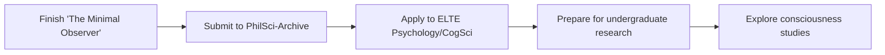

<div align="center">

# 👋 Hi, I'm Yusuf Cemal İşbuğa

**Independent Researcher | Aspiring Cognitive Scientist | Open Science Advocate**

[](https://orcid.org/0009-0001-7565-9753)
[](https://scholar.google.com/citations?user=S0SdpTwAAAAJ)
[](https://evrimagaci.org/leo2311454/blog)

*"Transparent iteration. Publish failures. Validate rigorously."*

</div>

---

## 🎯 Who Am I?

```python
class Researcher:
    def __init__(self):
        self.name = "Yusuf Cemal İşbuğa"
        self.age = 19
        self.location = "Istanbul, Turkey"
        self.status = "High School Graduate (2024) → Psychology/CogSci Undergrad (2025+)"
        self.mission = "Bridging theoretical physics, computation, and cognitive science"
        
    def research_interests(self):
        return {
            "theoretical_physics": [
                "Quantum Measurement Theory",
                "Thermodynamics & Information",
                "Observer Effects & Consciousness"
            ],
            "computational": [
                "Energy Systems Optimization",
                "Control Theory",
                "Neural Network Modeling"
            ],
            "cognitive_science": [
                "Philosophy of Mind",
                "Information Processing",
                "Mind-Matter Interface",
                "Temporal Consciousness"
            ]
        }
    
    def current_projects(self):
        return [
            "The Minimal Observer: Time travel thought experiment",
            "HEPV Feasibility Analyzer: Published thermodynamic analysis",
            "Preparing ELTE Psychology/CogSci applications"
        ]
    
    def philosophy(self):
        return {
            "transparency": "Publish failures, not just successes",
            "rigor": "Peer-review > personal belief",
            "openness": "All code open-source, all data shared",
            "honesty": "Version history shows real research process"
        }
```

---

## 💡 What Makes Me Different?

<div align="center">

| 🔬 **Early Start** | 📝 **Radical Transparency** | 🌍 **Public Science** | 🤝 **Open Collaboration** |
|:---:|:---:|:---:|:---:|
| Peer-reviewed at 18 | I publish my failures | 800+ readers on science blog | All projects open-source |
| CERN participant at 17 | Version history = research journey | Neuroscience & psychology outreach | MIT/Apache licenses |

</div>

---

## 🏆 Research Highlights

<table>
<tr>
<td width="33%" align="center">

### ⚛️ **CERN 2023**
**Beamline for Schools Competition**

🔹 Team STRANGER/Turkey  
🔹 Muon lifetime measurement proposal  
🔹 Experimental design & methodology  
🔹 Age: 17  

</td>
<td width="33%" align="center">

### 📄 **MDPI 2025**
**Conference Publication (ECP 2025)**

🔹 First-author research paper  
🔹 Hybrid propulsion thermodynamics  
🔹 Peer-reviewed & accepted  
🔹 Age: 18  

[📖 Read Paper](https://sciforum.net/paper/view/24624)

</td>
<td width="33%" align="center">

### ✍️ **Science Communication**
**Popular Science Writer**

🔹 800+ readers (Evrim Ağacı)  
🔹 Neuroscience, psychology, physics  
🔹 Turkish science community leader  
🔹 5+ published articles  

[📚 Read Blog](https://evrimagaci.org/leo2311454/blog)

</td>
</tr>
</table>

---

## 🔥 Featured Projects

### 🚗 [HEPV Feasibility Analyzer](https://github.com/yusufcemalisbuga/HEPV-Feasibility-Analyzer)

<div align="center">

[](https://sciforum.net/paper/view/24624)
[](https://www.python.org/)
[](https://github.com/yusufcemalisbuga/HEPV-Feasibility-Analyzer/blob/main/LICENSE)
[](https://github.com/yusufcemalisbuga/HEPV-Feasibility-Analyzer)
[](https://github.com/yusufcemalisbuga/HEPV-Feasibility-Analyzer/stargazers)

</div>

> **Research Question:** Can compressed-air hybridization compete with pure battery EVs?  
> **Answer:** **No.** +2.9% efficiency penalty makes it commercially non-viable.  
> **Impact:** First open-source, peer-reviewed thermodynamic proof preventing future R&D resource waste.

#### 📊 **The Transparent Research Journey**

<details>
<summary><b>🔍 Click to see honest version history (failures included!)</b></summary>

<br>

**Real Research = Iteration + Failure + Learning**

```diff
v1.0 (2022): Passive pneumatic system
! Result: +11% efficiency penalty
- Conclusion: Commercial failure, but learned thermodynamics fundamentals
+ Lesson: Isothermal compression is theoretically ideal, not practical

v2.0 (2023): Active thermal management added
! Result: +7% penalty (improvement!)
~ Progress made, but still not commercially viable
+ Lesson: Heat recovery helps, but compression losses dominate

v3.0 (2024): Optimized control strategy
! Result: -5% efficiency improvement (SUSPICIOUS!)
? Red flag: Result too good to be true
+ Lesson: Always validate "breakthrough" results

v3.1.0 beta (2025): Physics-corrected model
+ Result: +2.9% penalty (peer-reviewed & validated)
✓ Conclusion: Compressed air hybridization is thermodynamically inferior
✓ Published: MDPI ECP 2025
+ Lesson: Negative results are valuable results
```

**Why publish this?**  
Because **science is about truth, not ego**. Showing my failures helps others avoid the same mistakes.

</details>

#### 🛠️ **Technical Stack**

```python
{
    "Language": "Python 3.8+",
    "Libraries": ["NumPy", "Matplotlib", "SciPy"],
    "Models": ["Thermodynamic cycles", "Energy flow analysis", "Control optimization"],
    "Validation": ["Peer-reviewed", "Conference-accepted", "Open-source reproducible"]
}
```

#### 🎯 **Key Features**

- ✅ **Thermodynamically rigorous** (follows 1st & 2nd laws)
- ✅ **Peer-reviewed validation** (MDPI ECP 2025)
- ✅ **Fully open-source** (MIT license)
- ✅ **Reproducible results** (Jupyter notebooks included)
- ✅ **Honest iteration** (version history preserved)

---

### 🧠 [The Minimal Observer](https://github.com/yusufcemalisbuga/minimal-observer) *(Coming Soon)*

<div align="center">

[](https://github.com/yusufcemalisbuga/minimal-observer)
[](https://github.com/yusufcemalisbuga/minimal-observer)

</div>

> **Research Question:** Can a "minimal observer" passively witness the past without altering it?  
> **Approach:** Quantum mechanics + Thermodynamics + Philosophy of mind  
> **Status:** Manuscript in preparation (target: PhilSci-Archive preprint → journal submission)

#### 🔑 **Core Concepts**

- **World Time vs Universe Time**: Subjective experience vs block universe structure
- **Quantum Decoherence**: Why perfect passive observation is impossible
- **Landauer's Principle**: Information processing has thermodynamic cost
- **Temporal Suicide**: Observer's present consciousness dissolves in time travel

#### 📚 **Influences**

Tegmark (2000), Zurek (2003), Bennett (2003), Hawking (1992), Deutsch & Lockwood (1994)

---

## 📈 GitHub Stats

<div align="center">


</div>

---

## 🌱 Current Focus (2024-2025)



**Short-term goals:**
- ✅ Complete "The Minimal Observer" manuscript (Target: Dec 2024)
- 🔄 Apply to ELTE University (Budapest) - Psychology/Cognitive Science (Target: Jan-Mar 2025)
- 🔄 Build computational neuroscience skills (Python, neural modeling)

**Long-term vision:**
- PhD in Cognitive Science / Philosophy of Mind
- Research at intersection of physics, computation, and consciousness
- Continue open science advocacy

---

## 📫 Let's Connect!

<div align="center">

[](mailto:yusufcemalisbuga@gmail.com)
[](https://www.linkedin.com/in/yusufcemalisbuga)
[](https://twitter.com/yusufisbuga)

**Open to:**
- 🤝 Research collaborations (consciousness, quantum foundations, computational neuroscience)
- 💬 Science communication projects
- 📚 Mentorship opportunities (helping other young researchers)
- 🎓 Undergraduate research positions (2025+)

</div>

---

## 💭 Philosophy

> *"The best research is transparent research. I publish my failures because they teach more than my successes. If my work can save someone else 27 months of effort, that's a win for science."*

---

## 📜 Publications & Profiles

- **ORCID:** [0009-0001-7565-9753](https://orcid.org/0009-0001-7565-9753)
- **Google Scholar:** [S0SdpTwAAAAJ](https://scholar.google.com/citations?user=S0SdpTwAAAAJ)
- **Evrim Ağacı Blog:** [800+ Readers](https://evrimagaci.org/leo2311454/blog)

---

<div align="center">

### ⭐ If you find my work interesting, consider starring my repos!

**"Science is a relay race, not a solo sprint. Let's pass the baton together."**


</div>
```

---
